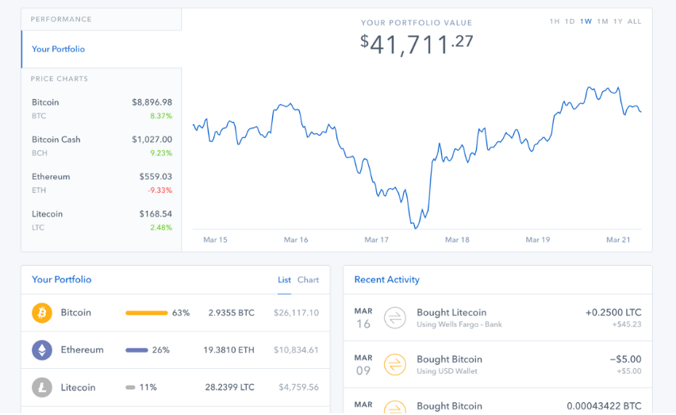

## Visual

## Desc
Automatically track crypto digital assets, the value of your coins. 
Users will be able to see a graph displaying the current market value of their crypto.
Features:
- See a specific period of time with different measurements, like average price in that period of time.
- Be able to see just one, or the selection of the user wants in the graph.

## Logic
- Log in to your app and click Investments.
- Click on the plus sign (+) to begin connecting an account.
- Search "crypto" or search by vendor name to find your investment account of choice.
- Choose the vendor and enter your account details.
